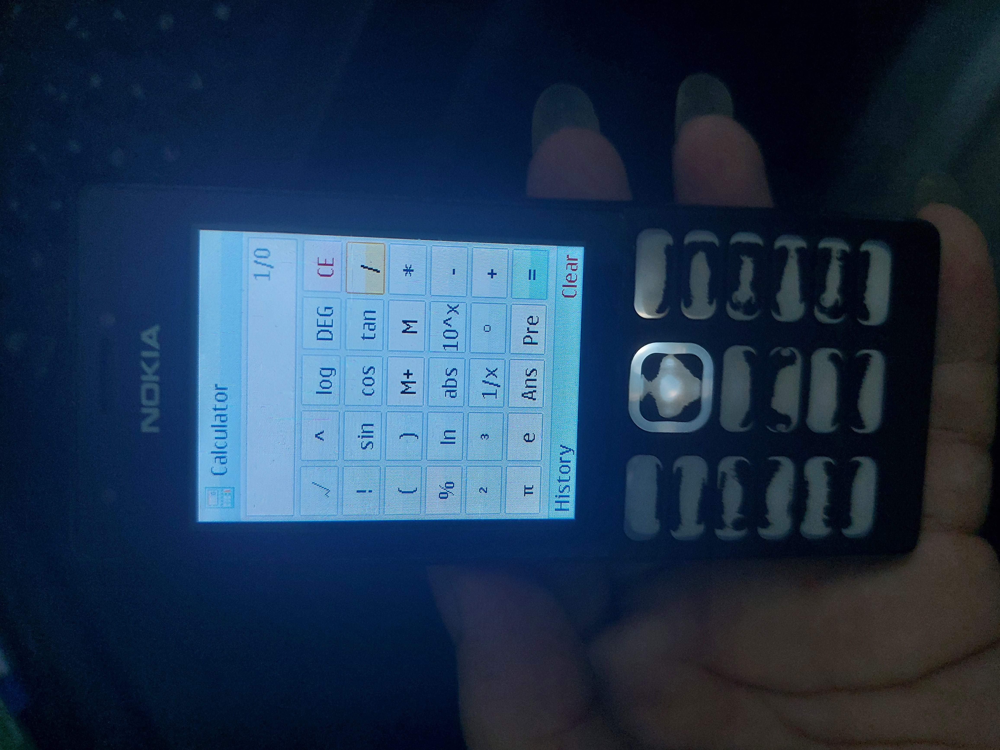
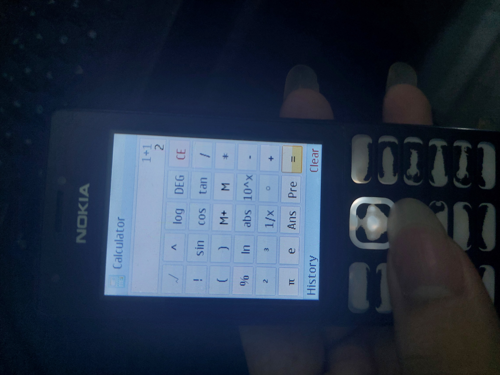

Don't you hate it when you forget your calculator and only brought your dumb phone?

Inspired by Windows 7 Calculator.
Created using MRE Makefile by gtrxAC: https://github.com/gtrxAC/mre-makefile

Below is the AI description (i'm too lazy to write instruction):

---

# MRE Calculator

A Windows 7 Aero Glass inspired scientific calculator application for **MediaTek MRE** feature phones (such as the Nokia 216, Nokia 222, Nokia 225, Nokia 230, etc.).

[](https://github.com/LongInfinity/mre-calculator/releases/latest/download/Calculator.vxp)

---

## 📸 Gallery

### Divide by zero and normal calculation

| Divide by Zero (`1/0`) | Normal Calculation (`1+1 = 2`) |
| :---: | :---: |
|  |  |

---

## 📥 Download

* **Direct App Download**: [**`Calculator.vxp` (Latest Release)**](https://github.com/LongInfinity/mre-calculator/releases/latest/download/Calculator.vxp)
* **Releases & Source Archives**: [GitHub Releases Page](https://github.com/LongInfinity/mre-calculator/releases)

### How to Install on Phone:
1. Download **`Calculator.vxp`**.
2. Connect your phone or insert your microSD card into your PC.
3. Copy `Calculator.vxp` to `vxp/apps/`, `vxp/`, or `MRE/` folder on your memory card.
4. On your phone, open the **File Manager**, select `Calculator.vxp`, and launch it.

---

## ✨ Features

* **Windows 7 Aero Glass UI**: 34px Aero title bar with authentic Windows 7 Calculator icon extracted from `calc.exe`, 1px clipped corner buttons, and smooth focus glow effects.
* **Smooth 60 FPS Animations**: 1/6s (166.7ms) quartic Ease-Out slide animations when opening and closing the History menu.
* **Rich Math Functions**:
  * Trigonometry: `sin`, `cos`, `tan` (with DEG / RAD angle modes)
  * Logarithms & Roots: `log`, `ln`, `logₙ(base, arg)`, `√`, `∛`, `ⁿ√`
  * Powers & Factorials: $x^2$, $x^3$, $x^{-1}$, $x^y$, $n!$, `%`, `abs`
  * Implicit multiplication support: `2(3+4)`, `5sin(30)`, `2π`
* **DMS (Degrees, Minutes, Seconds) Support**:
  * Type up to 3 `°` symbols per number ($D^\circ M^\circ S^\circ$):
    * `1°` $= 1$
    * `0°1°` $= 1/60$
    * `0°0°1°` $= 1/3600$
    * `1°30°36°` $= 1.51$
* **Calculation History**: Stores up to 20 past calculations with quick recall into the active equation.
* **Memory & Constants**: `M+`, `M-`, `MR`, `MC`, `Ans`, `PreAns`, $\pi$, $e$.

---

## 🛠️ Build Instructions

### Prerequisites (Windows)
1. **w64devkit** (provides GNU `make` and tools): [Download w64devkit](https://github.com/skeeto/w64devkit/releases)
2. **xPack ARM GCC Toolchain** (`arm-none-eabi-gcc`): [Download xPack GCC](https://github.com/xpack-dev-tools/arm-none-eabi-gcc-xpack/releases)
3. **Python 3** (used by `sdk/build.py` to package `.vxp` binaries)

Add `w64devkit/bin` and `arm-none-eabi-gcc/bin` to your `PATH`.

### Compiling:
```bash
# Build the project (generates Calculator.vxp in project root)
make

# Clean previous build artifacts
make clean
```

---

## 📄 License & Credits
* Base MRE build environment by [gtrxAC](https://github.com/gtrxAC/mre-makefile).
* Licensed under the [MIT License](LICENSE).

